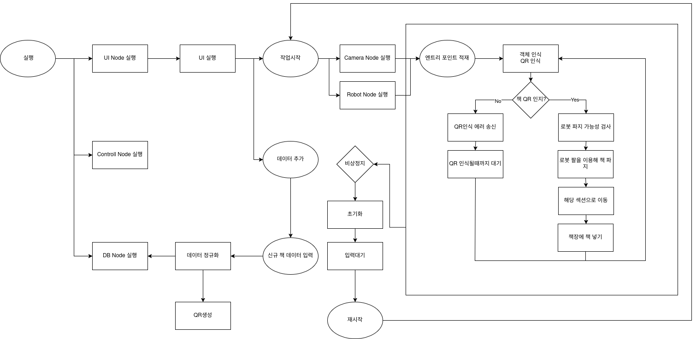
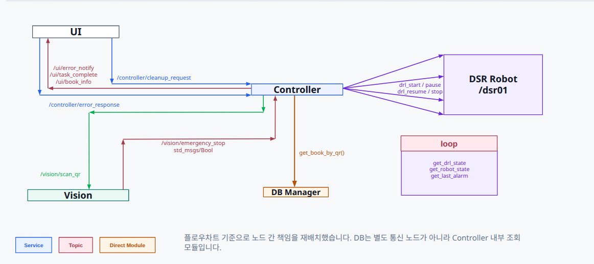

# rokey-bootcamp-group-A-3
rokey 부트캠프 프로젝트 A - 3조 레포지토리


# [Auto Book Return System (ABRS)] 
> **조 이름:** [A-3 - ROKEY]
> **팀원:** [박재현_홍준형_이동욱_이훈근]

## 1. 🎨 시스템 설계 및 플로우 차트
프로젝트의 전체적인 구조와 소프트웨어 흐름도입니다.

### 1-1. 시스템 설계도 (System Architecture)
<p align="center">
  
</p>
* *설명: *

### 1-2. 플로우 차트 (Flow Chart)
<p align="center">
  
</p>
* *설명: [시스템 구조와 전체 task 흐름]*

---

## 2. 🖥️ 운영체제 환경 (OS Environment)
이 프로젝트는 다음 환경에서 개발하였습니다.

* **OS:** Ubuntu 22.04 LTS
* **ROS Version:** ROS2 Humble
* **Language:** Python 3.10.12
* **IDE:** VS Code

---

## 3. 🛠️ 사용 장비 목록 (Hardware List)
프로젝트에 사용된 주요 하드웨어 장비입니다.

| 장비명 (Model) | 수량 | 비고 |
|:---:|:---:|:---|
| [m0609] | 1 | [1] |
| [HCAM01L] | 1 | [1] |
| [반납대] | 1 | [1] |
| [책장] | 1 | [1] |

---

## 4. 📦 의존성 (Dependencies)
프로젝트 실행에 필요한 라이브러리입니다.

* **[예시]**
* pymongo
* PyQt6
* qrcode[pil]
* opencv-python
* numpy


---

## 5. ▶️ 실행 순서 (Usage Guide)
프로젝트를 실행하기 위한 순서입니다. 터미널 명령어를 순서대로 입력해 주세요.
### Step 1. [로봇 초기화] 로봇의 전원을 켜고 통신을 연결합니다.
```bash
ros2 launch  app app_start.launch.py
```
### Step 2. [분류시작] 분류 시작 버튼을 눌러 메인 task를 실행 합니다.

### Step 3. [오류처리] 분류 과정 중 발생한 오류는 UI를 통해 인지하고 처리합니다.

### Step 4. [분류완료] 분류 과정이 완료되면 분류시작/초기화 버튼을 통해 task를 재시작 할 수 있습니다.

### Step 5. [종료] UI의 종료 버튼을 누르고 터미널에 프로세스를 종료합니다.
